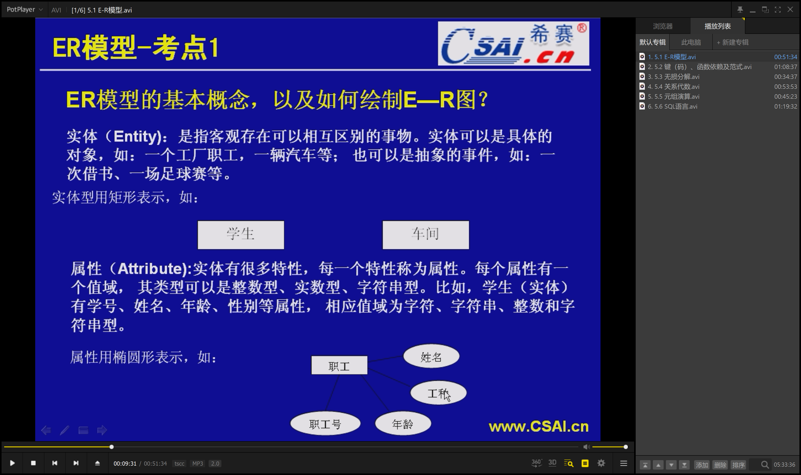
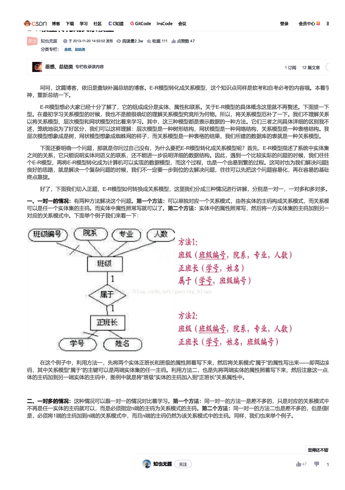
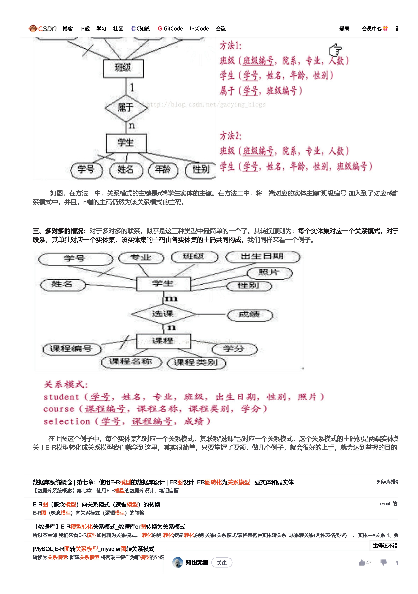

### 数据库学习的重要知识点

#### ER图和关系模式
1. 要学会画E-R图，就是实体-关系图

> 联系有：1:1, 1:N, M:N

-----------------------

2. 要学会将**ER图**转化为**关系模式**

可以参考这[ER图转化为关系模式_blog](https://blog.csdn.net/gaoying_blogs/article/details/16843515)，我认为就是想将ER图变为数据库表

---------------------------------------------------------
#### 键（码），函数依赖及范式
