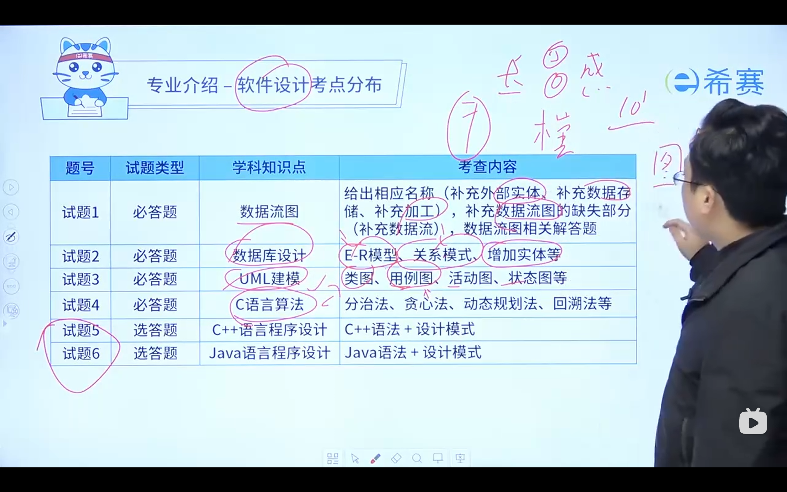

> create file 20241217, wtx 

### 总体介绍软考
报名网址是[软考官网](https://www.ruankao.org.cn/)
--------------------------

1. 考试流程
考试时间是`2025年5月份`，报名时间是

> 考试内容
两科：**综合知识** 和 **软件设计**
考试时间为150分钟
分数45合格

2. 考试内容
* 综合知识，都是客观题，满分75
    软考上午知识点

* 软件设计，6道答题（前4道必答，后2道二选一），满分75

    软考下午知识点

